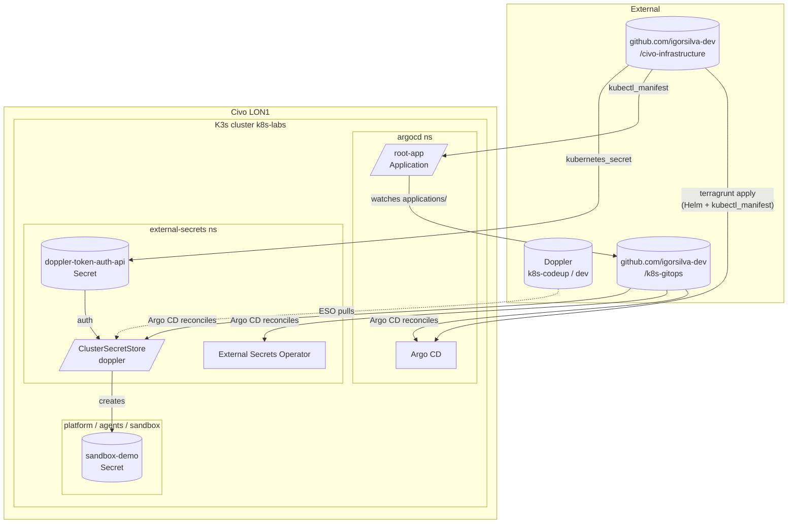

# civo-infrastructure

Terraform-managed Civo K3s cluster + Argo CD bootstrap. Pairs with [`k8s-gitops`](https://github.com/igorsilva-dev/k8s-gitops) (Argo CD's source of truth) and [`tf-modules`](https://github.com/igorsilva-dev/tf-modules) (reusable modules). A single `terragrunt apply` brings up the cluster, namespaces, Argo CD, and the root Application that hands off everything else to GitOps.

## Architecture



The deeper story lives in [`docs/architecture.md`](docs/architecture.md). Non-obvious choices are in [`docs/adr/`](docs/adr/).

## What this repo provisions

- A K3s cluster on Civo (`g4s.kube.medium`, single worker for portfolio cost) plus its network and firewall.
- Five namespaces — `platform`, `agents`, `sandbox`, `external-secrets`, `argocd`.
- Argo CD via the official Helm chart (one-time Terraform-managed install; Argo CD owns itself after first sync).
- A single `root-app` Application CR pointing at [`k8s-gitops`](https://github.com/igorsilva-dev/k8s-gitops) — every other workload reconciles from there.
- The Doppler service-token Secret (the one secret Terraform manages, so External Secrets Operator can pull everything else from Doppler).

Day-to-day app changes happen in `k8s-gitops`, not here. This repo is the bootstrap.

## Reproduction guide

### Prerequisites

- [asdf](https://asdf-vm.com/) (tool versions live in `.tool-versions`).
- A Civo account + API key.
- A Doppler workspace with a project named `k8s-codeup`, config `dev`, and a service token issued for it (read access only).
- A GitHub fork of this repo with the following Actions secrets set: `CIVO_ACCESS_KEY`, `CIVO_SECRET_KEY`, `CIVO_TOKEN`, `DOPPLER_TOKEN`.

### Local apply (one-shot)

```sh
asdf install                                  # installs terragrunt + opentofu + pre-commit at pinned versions
export CIVO_ACCESS_KEY=...                    # or use civo CLI: civo apikey save / use
export CIVO_SECRET_KEY=...
export CIVO_TOKEN=...
export TF_VAR_doppler_token=...               # Doppler service token for k8s-codeup/dev

cd environments/lon1/dev
terragrunt init
terragrunt apply
```

Apply takes ~5 minutes on a clean state and creates everything end to end: network → cluster → namespaces → Doppler-token Secret → Argo CD Helm release → root Application CR.

### CI apply

Push to `main`. The deployment workflow runs `terragrunt apply -auto-approve` for `environments/lon1/dev`. Same env vars as above, sourced from Actions secrets.

## Accessing the Argo CD UI

`kubectl port-forward` is broken on K3s 1.34 + containerd 2.1.x (known CRI regression). Use `kubectl proxy` instead. Argo CD is configured with `server.rootpath` + `server.basehref` to work behind the apiserver service proxy, which means the access URL is *doubled* (apiserver-proxy prefix + Argo CD's own rootpath):

```sh
kubectl proxy &
open "http://localhost:8001/api/v1/namespaces/argocd/services/http:argocd-server:http/proxy/api/v1/namespaces/argocd/services/http:argocd-server:http/proxy/"
```

Login: `admin` / value of `kubectl -n argocd get secret argocd-initial-admin-secret -o jsonpath='{.data.password}' | base64 -d`.

The doubled URL goes away in Phase 2 when Istio + ingress lands.

## GitOps flow — adding a workload

Workloads aren't added here. They go in [`k8s-gitops/applications/`](https://github.com/igorsilva-dev/k8s-gitops/tree/main/applications) as Argo CD `Application` CRs. The `root-app` Application managed by this repo watches that directory, picks up new entries on each reconciliation cycle (a few minutes), and applies them.

See [`k8s-gitops/README.md`](https://github.com/igorsilva-dev/k8s-gitops#adding-a-new-workload) for the workflow.

## Secret management

Secrets live in Doppler. External Secrets Operator (installed via `k8s-gitops/applications/external-secrets.yaml`) authenticates with the `doppler-token-auth-api` Kubernetes Secret seeded by this repo's Terraform (`infrastructure/secrets.tf`, value from `TF_VAR_doppler_token`). A `ClusterSecretStore` named `doppler` exposes the Doppler project/config to the cluster; `ExternalSecret` resources in any namespace then pull values into regular Kubernetes Secrets.

To add a new secret:

1. Add it in the Doppler dashboard (`k8s-codeup` project, `dev` config).
2. Create an `ExternalSecret` in `k8s-gitops/external-secrets/config/` referencing the key.
3. Push. Argo CD reconciles; the Kubernetes Secret appears in the target namespace.

The Doppler token itself is the only secret that has to exist *before* ESO can run, which is why Terraform manages it. Everything else flows through GitOps.

Why ESO + Doppler over Sealed Secrets is in [`docs/adr/0002-eso-over-sealed-secrets.md`](docs/adr/0002-eso-over-sealed-secrets.md).

## Repo layout

```
civo-infrastructure/
├── infrastructure/                  # Terraform source, env-agnostic
│   ├── versions.tf                  # required_providers (civo, kubernetes, helm, kubectl)
│   ├── kubernetes_provider.tf       # k8s/helm/kubectl providers from parsed kubeconfig
│   ├── network.tf                   # consumes tf-modules/civo/network
│   ├── kubernetes.tf                # consumes tf-modules/civo/kubernetes + tf-modules/helm (Argo CD)
│   ├── namespaces.tf                # consumes tf-modules/kubernetes/namespaces-rbac
│   ├── secrets.tf                   # Doppler-token Kubernetes Secret
│   ├── variables.tf                 # var.doppler_token (sensitive)
│   ├── outputs.tf                   # kubeconfig, cluster_name
│   ├── argocd_bootstrap.tf          # kubectl_manifest for root-app Application
│   └── manifests/root-app.yaml.tftpl
├── environments/
│   └── lon1/dev/                    # Terragrunt stack: terragrunt.hcl + environment.yaml
├── .github/workflows/               # preview / deployment / destroy
├── root.hcl                         # Terragrunt remote-state backend (Civo Object Store)
└── docs/                            # architecture deep-dive + ADRs
```

## Tooling

| Tool | Version | Role |
|---|---|---|
| OpenTofu | 1.10.3 | Terraform engine |
| Terragrunt | 0.84.1 | Backend generation, env stacks |
| asdf | latest | Tool version management |
| pre-commit | 3.6.2 | Local formatting / validation hooks |

CI runs the same versions via asdf. Pre-commit hooks: `terraform_fmt`, `terraform_validate`, trailing-whitespace, end-of-file-fixer, merge-conflict-check.

## Cost

~$22/mo at current sizing: a 1-node `g4s.kube.medium` cluster (~$20/mo) + Civo network/firewall (free) + Civo Object Store state bucket (~$1-2/mo) + Doppler free tier ($0). Detailed breakdown in [`docs/cost.md`](docs/cost.md) once CIVO-009 lands.

## Related repos

- [`tf-modules`](https://github.com/igorsilva-dev/tf-modules) — reusable Terraform modules consumed here (network, kubernetes, helm, namespaces-rbac).
- [`k8s-gitops`](https://github.com/igorsilva-dev/k8s-gitops) — Argo CD source of truth. Workloads, Helm values, ESO config.
